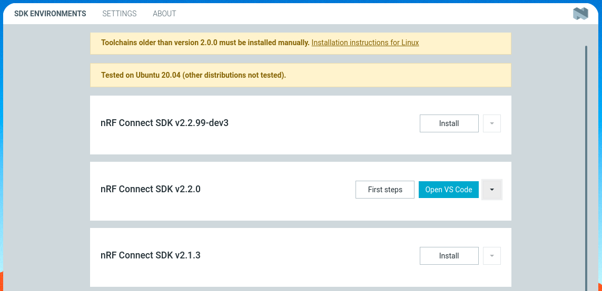

# How East works?

This document describes how East works, how it detects NCS SDK versions, what
checks it runs before every Workspace command, etc.

Reading this document is a not prerequisite for using East, however, it is
recommended.

## Table of Contents

<!-- vim-markdown-toc GFM -->

- [East and nRF Toolchain Manager](#east-and-nrf-toolchain-manager)
  - [nRF Toolchain Manager executable](#nrf-toolchain-manager-executable)
    - [Isolated environments of nRF Toolchain Manager](#isolated-environments-of-nrf-toolchain-manager)
- [System and Workspace commands](#system-and-workspace-commands)
  - [System commands](#system-commands)
  - [Workspace commands](#workspace-commands)
  - [Pre-workspace check](#pre-workspace-check)
    - [Supported West workspaces in isolated environments](#supported-west-workspaces-in-isolated-environments)
- [East storage location](#east-storage-location)

<!-- vim-markdown-toc -->

## East and nRF Toolchain Manager

Some time ago Nordic developed their [nRF Connect for Desktop] app, which is a
cross-platform framework that contains many smaller apps for assisting
development on nRF devices. One of these apps is the **nRF Toolchain Manager**,
an app that manages nRF Connect SDKs and toolchains.

<p align="center">
  <br>
  <i>nRF Toolchain Manager inside nRF Connect for Desktop GUI</i><br>
</p>

nRF Toolchain Manager allows you to:

- Install SDK and toolchain for a specific version of nRF Connect SDK
- Open the terminal window, in which you have access to the toolchain binaries
  (`arm-none-eabi-gcc` and friends)
- Open VS Code and use their [extension] to develop applications (VS Code users
  should definitely check the extension, it has a lot of cool features).

One of the most important functionalities of nRF Toolchain Manager is its
capability to easily download and install the toolchain required for the
development. Anyone that ever had to [manually] installs the required tooling
knows how time-consuming and error prone it is, especially if:

- You are doing it for the first time.
- You are switching between several projects that use different NCS versions.
- You have a team of developers working on the same project that need to use the
  same version of the toolchain to ensure reproducible builds.
- You want to set up a CI pipeline to automate your release processes.

[nrf connect for desktop]:
  https://www.nordicsemi.com/Products/Development-tools/nrf-connect-for-desktop
[extension]:
  https://www.nordicsemi.com/Products/Development-tools/nrf-connect-for-vs-code
[manually]:
  https://developer.nordicsemi.com/nRF_Connect_SDK/doc/latest/nrf/gs_installing.html

### nRF Toolchain Manager executable

GUI version of the nRF Toolchain Manager uses an executable version under the
hood, that is hosted on their GitHub repository:
https://github.com/NordicSemiconductor/pc-nrfconnect-toolchain-manager/tree/main/resources/nrfutil-toolchain-manager
(East uses executable in the `linux` directory).

Below is a shortened output of the `nrfutil-toolchain-manager.exe --help`
command:

```shell
❯ ./nrfutil-toolchain-manager.exe
nrfutil-toolchain-manager 0.8.0

USAGE:
    nrfutil toolchain-manager [FLAGS] [OPTIONS] [SUBCOMMAND]

SUBCOMMANDS:
    config     Get/set toolchain manager settings
    env        Display the toolchain environment
    help       Show comprehensive documentation
    install    Install toolchains
    launch     Launch applications/shells with the toolchain environment
    list       List installed toolchains
    remove     Remove toolchains
    search     Search for installable toolchains
```

Note:

- `search` subcommand shows all toolchain versions that can be installed (same
  ones that are shown in GUI version),
- `install` downloads and installs them.

The `launch` subcommand is the most interesting one: a given arbitrary command
can be executed within the toolchain environment, giving you access to the
toolchain programs that are not installed system-wide on your machine:

```shell
~/.local/share/east
❯ arm-zephyr-eabi-gcc --version
zsh: command not found: arm-zephyr-eabi-gcc
❯ west --version
West version: v0.13.1


~/.local/share/east
❯ ./nrfutil-toolchain-manager.exe launch --ncs-version v2.2.0 -- arm-zephyr-eabi-gcc --version
arm-zephyr-eabi-gcc (Zephyr SDK 0.15.1) 12.1.0
Copyright (C) 2022 Free Software Foundation, Inc.
This is free software; see the source for copying conditions.  There is NO
warranty; not even for MERCHANTABILITY or FITNESS FOR A PARTICULAR PURPOSE.

❯ ./nrfutil-toolchain-manager.exe launch --ncs-version v2.2.0 -- west --version
West version: v0.14.0
```

Mentioned commands are important for East, as East uses them while executing
Workspace commands.

#### Isolated environments of nRF Toolchain Manager

It is important to keep in mind what isolated environments can do and what they
can't:

- They will run their own version of a specific program, even if you have that
  program available on the system `PATH`.
- If you want to run a specific program that is not installed in them, they will
  fallback to the one provided by the `PATH` variable.

Isolated environments provided by the nRF Toolchain Manager are **not** Docker
containers, although they might look like them. They behave more like Conda
environments.

## System and Workspace commands

East supports several commands which are split into two groups:

- System commands
- Workspace commands

### System commands

System commands can be run from _any directory_ on the machine. They always
produce the _same_ exact action using the _same_ execution process, regardless
from where are they run.

### Workspace commands

Workspace command can be only run from _inside of a West workspace_.

West workspace starts at the directory (aka. _topdir_ by West convention) that
contains the `.west` folder and encompasses its children's directories.

Workspace commands still produce the _same_ action, regardless of where are they
run (just like the System commands), but they can use a _different_ execution
process depending on several factors.

### Pre-workspace check

Every Workspace command runs a pre-workspace command check before it executes
its main command.

This check ensures that below statements are true:

1. Workspace commands can only run from the inside of the West workspace.
2. Workspace commands can only run if the nRF Toolchain Manager executable is
   installed on the development machine (via the `east install` command).
3. Presence of the `east.yml` is optional, however, if present the contents of
   the file should be valid (see [configuration] for more info about this file).
4. If detected NCS SDK version **is supported** by the nRF Toolchain Manager, it
   should also be installed (if that is not the case, tell the user to run
   `east install toolchain` and exit).
5. If detected NCS SDK version **is not supported** by the nRF Toolchain Manager
   (or current West workspace does not use `sdk-nrf` one of the imported West
   modules), silently pass through.

_Note: detected NCS SDK version is inferred from the `west.yml` file, from the
revision string of the `sdk-nrf` module._

[configuration]: configuration.md

After the pre-workspace check is done, the main command is executed. It could be
a west command (`east build` runs `west build`) or it could be a simple shell
command.

Whatever command it is:

- If the fourth statement is true, then the command is passed into
  `nrfutil-toolchain-manager.exe launch -- <arbitrary command>` call. **That
  command now runs in its own isolated environment**.
- If the fifth statement is true, the command is executed with the usual Python
  `subprocess.Popen()` call. That way East can be used on older NCS projects
  (like `v1.8.0`) or even normal Zephyr projects, so users do not have to change
  to using the West tool, where East suffices.

#### Supported West workspaces in isolated environments

East works best with _repository_ and _workspace_ type of Zephyr applications,
as described in the Zephyr documentation
[here](https://docs.zephyrproject.org/latest/develop/application/index.html#application-types).
"Best" is meant where that it can detect whether the application uses NCS SDK
and whether that SDK version is supported. Currently, it can't determine the SDK
version for the _freestanding_ Zephyr applications.

You can learn
[here](https://docs.zephyrproject.org/latest/develop/application/index.html#creating-an-application)
how to create an application repository, Zephyr also provides an excellent
[example-application](https://github.com/zephyrproject-rtos/example-application)
repository, which serves as good starting point (however it does not use NRF SDK
in its `west.yml`).

## East storage location

East stores downloaded nRF Toolchain Manager executable, tools and installed
toolchains in the `~/.local/share/east` folder in several subfolders. Deleting
this folder would require you to rerun the `east install` commands.
